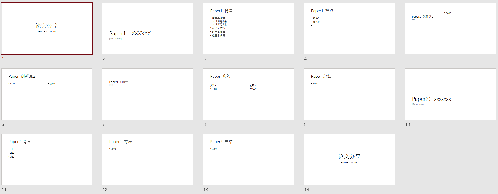
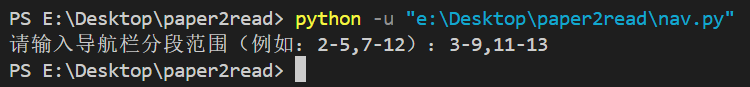
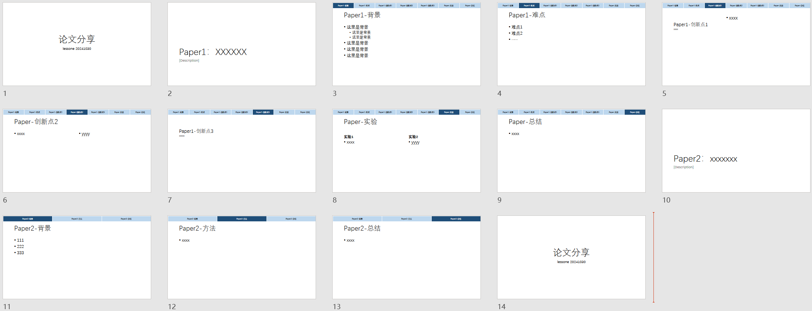

[toc]

# PPT-auto-nav

## 实际效果

添加导航栏前的PPT：



**自动**添加导航栏后的PPT：


## 介绍

在现代学术研究中，清晰且专业的演示文稿对于有效传达研究成果至关重要。这款**PPT自动导航栏生成工具**旨在帮助研究生在组会中自动生成美观的PPT导航栏，从而~~在老师提问时快速翻页~~使逻辑更加清晰，方便理解。

## 功能特点

- [x] **自动提取标题**：工具会自动扫描每张幻灯片，提取*第一个文本框（有点不合理但是不知道怎么改了）*中的内容作为该页的标题，确保导航栏的准确性。

- [x] **自定义分段**：支持**多篇论文、多段任务**的汇报，用户可以灵活指定导航栏的分段方式，例如通过输入“2-5,7-12”来设定具体的幻灯片范围。

- [x] **动态导航栏**：导航栏会提示当前处于那个页面，方便展示。

- [x] **超链接支持**：每个导航项都设置了超链接，点击后将直接跳转到对应的幻灯片。

- [x] **可自定义的外观**：~~个人审美有限，自己修改样式参数吧~~

## 使用教程

1. 安装python环境

~~网上教程很多，此处省略了\~\~~~

2. 安装python-pptx

在命令行运行下面的命令：
``` bash
pip install python-pptx
```

3. 修改文件名称***或***脚本内的文件名称

将 `需要添加导航栏的ppt` 的文件名称修改为 `input.pptx`，***或***将脚本中的 `input.pptx`修改为`需要添加导航栏的ppt`的名称

4. 运行脚本程序

再使用下面的命令运行脚本程序：

``` bash
python auto_nav.py
```



根据提示输入导航栏分段的范围，以下面的PPT为例：


- 第1页是开头页
- 第2页是第一篇paper的标题
- 第3-9页是第一篇paper的主体展示
- 第10页是第二篇paper的标题
- 第11-13页是第二篇paper的主体展示
- 第14页是结尾页

只需要分段输入主体部分的页码，因此选择输入`3-9,11-13`*(**英文**的逗号)*

5. 查看运行结果并根据实际情况调整



生成导航栏后的PPT已经输出到了同目录下的`output.pptx`中，可以看到，导航栏已经分段生成，可以根据实际情况进行进一步修改。